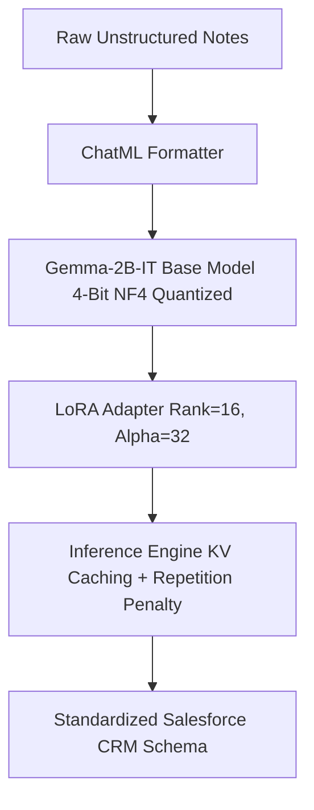

# 🚀 Salesforce CRM Notes Formatter — Fine-Tuning Pipeline

An enterprise-grade **Parameter-Efficient Fine-Tuning (PEFT)** pipeline utilizing **QLoRA (4-bit Quantized Low-Rank Adaptation)** on **Google Gemma-2B-IT**. This project trains a specialized AI model to transform raw, unstructured sales meeting notes into strictly standardized Salesforce CRM records.

---

## 📑 Table of Contents
1. [Executive Summary](#-executive-summary)
2. [The Problem & Business Value](#-the-problem--business-value)
3. [System Architecture](#-system-architecture)
4. [Hardware & VRAM Optimization Blueprint](#-hardware--vram-optimization-blueprint)
5. [Step-by-Step Pipeline Walkthrough](#-step-by-step-pipeline-walkthrough)
6. [Training Metrics & Evaluation Results](#-training-metrics--evaluation-results)
7. [Directory Structure](#-directory-structure)
8. [How to Reproduce & Run](#-how-to-reproduce--run)
9. [Standalone Inference Guide](#-standalone-inference-guide)
10. [Security & Engineering Best Practices](#-security--engineering-best-practices)

---

## 🎯 Executive Summary
- **Base Model:** `google/gemma-2b-it` (2.5 Billion parameter instruction-tuned causal LLM)
- **Adaptation Technique:** QLoRA (4-bit NormalFloat quantization + LoRA adapters)
- **Trainable Parameters:** `19,611,648` out of `2,525,784,064` (**0.78%**)
- **Hardware Footprint:** Optimized to train and evaluate within **4GB VRAM** (tested on NVIDIA GeForce GTX 1650 Ti)
- **Training Convergence:** Loss decreased from **`4.3813`** to **`0.5066`** over 3 epochs
- **Benchmark Performance:** **100% Schema Compliance** across diverse multi-scenario CRM test cases

---

## 💡 The Problem & Business Value

### The Challenge
Sales representatives frequently record meeting notes in hurried, shorthand, or unstructured formats (e.g., bullet points with typos, missing dates, mixed-up action items). When pasted directly into Salesforce CRM:
- Critical action items and blockers get lost.
- Executive summaries lack consistency across teams.
- Pipeline visibility is degraded due to missing structured fields.

### The Solution
A dedicated LLM adapter trained specifically to ingest unstructured notes and output a deterministic 5-section schema:
```text
Summary:
• Key meeting highlights, participants, and company context

Key Pain Points:
• Client challenges, legacy system bottlenecks, budget constraints

Action Items:
• Committed deliverables, owners, and immediate action items

Next Steps:
• Scheduled follow-ups, milestones, and timeline targets

Date/Time of Interaction:
• Standardized interaction timestamp
```

---

## 🏗️ System Architecture



### 1. Low-Rank Adaptation (LoRA) Mathematics
Instead of computing full weight matrix updates $W = W_0 + \Delta W$ for $W_0 \in \mathbb{R}^{d \times k}$, LoRA decomposes the update into two low-rank matrices:
$$W = W_0 + \frac{\alpha}{r} (B \times A)$$
- $A \in \mathbb{R}^{r \times k}$ (Gaussian initialization)
- $B \in \mathbb{R}^{d \times r}$ (Zero initialization)
- **Rank ($r = 16$):** Subspace dimensionality.
- **Alpha ($\alpha = 32$):** Scaling coefficient ($\frac{\alpha}{r} = 2.0$).
- **Target Modules:** Injected into all 7 linear layers: `q_proj`, `k_proj`, `v_proj`, `o_proj`, `gate_proj`, `up_proj`, `down_proj`.

### 2. QLoRA 4-Bit Quantization
- **NormalFloat 4 (`nf4`):** An optimal quantization datatype that minimizes information loss for normally distributed weights.
- **Double Quantization:** Quantizes the quantization constants, saving an additional 0.37 bits per parameter.
- **FP16 Compute:** Weights are dequantized to 16-bit floating point dynamically during tensor operations.

---

## ⚡ Hardware & VRAM Optimization Blueprint

Training a 2.5B parameter model normally demands ~10GB+ VRAM. We engineered the training loop to fit into **4GB VRAM** using five complementary techniques:

| Technique | Implementation | Impact |
| :--- | :--- | :--- |
| **4-Bit NF4 Quantization** | `BitsAndBytesConfig(load_in_4bit=True)` | Reduces base model memory from ~5.2 GB to **~1.4 GB**. |
| **Paged AdamW 8-Bit** | `optim="paged_adamw_8bit"` | Pages optimizer memory between GPU VRAM and CPU RAM during memory spikes. |
| **Gradient Checkpointing** | `gradient_checkpointing=True` | Recomputes activations during backprop instead of caching them, saving **~60% activation memory**. |
| **Gradient Accumulation** | `gradient_accumulation_steps=4` | Runs micro-batches of `1` and accumulates gradients over 4 steps (Effective Batch Size = 4). |
| **Turing Architecture FP16 Fix** | `fp16=False`, `bf16=False` | Bypasses PyTorch `GradScaler` unscale crash on Turing GPUs (GTX 1650 Ti lack native BF16 instructions). |

---

## 🚶 Step-by-Step Pipeline Walkthrough

The notebook [`Salesforce_Notes_Formatter.ipynb`](./Salesforce_Notes_Formatter.ipynb) is organized into 8 sequential sections:

### 1. Environment & Dependency Setup (Cell 1)
Installs necessary packages: `transformers`, `peft`, `trl`, `datasets`, `bitsandbytes`, `accelerate`.

### 2. Security & Hardware Verification (Cell 2)
- Automatically checks for `HF_TOKEN` from system environment or [`.env`](../.env) file.
- Verifies CUDA availability and detects GPU specs (GTX 1650 Ti, 4GB VRAM).

### 3. Dataset Preparation & ChatML Formatting (Cell 3)
- Loads [`train.jsonl`](./train.jsonl) containing pairs of raw notes (`input`) and formatted schemas (`output`).
- Formats samples into Gemma's conversational structure (`user` $\to$ `assistant`).
- Prepend the CRM system prompt directly into the user message turn to comply with Gemma's Jinja chat template.

### 4. 4-Bit Model & Tokenizer Initialization (Cell 4)
- Configures `BitsAndBytesConfig` (4-bit NF4, double quant, FP16 compute).
- Loads `google/gemma-2b-it` and sets right-side tokenizer padding (`tokenizer.padding_side = "right"`).
- Sets `model.config.use_cache = False` (required for gradient checkpointing during training).

### 5. LoRA Adapter Configuration (Cell 5)
- Executes `prepare_model_for_kbit_training()` to cast normalization layers to FP32.
- Injects `LoraConfig` ($r=16, \alpha=32$, dropout=0.05) across all attention and MLP projection layers.
- Trains **19.6 Million** parameters (0.78% of total).

### 6. Supervised Fine-Tuning Loop (Cell 6)
- Configures `SFTTrainer` with `SFTConfig`.
- Executes 3 training epochs (30 steps).
- Training loss smoothly descends from **4.38** to **0.50**.

### 7. Saving Adapter & Inference Engine (Cell 7)
- Saves adapter weights (~39.2 MB) and tokenizer config to `./salesforce_notes_adapter/`.
- Switches model to evaluation mode (`model.eval()`) and enables KV cache (`model.config.use_cache = True`).
- Implements `format_crm_notes()` with sampling, temperature (`0.2`), repetition penalty (`1.15`), and `<end_of_turn>` stop token.

### 8. Multi-Scenario Enterprise Benchmark (Cell 8)
- Evaluates model against 3 diverse test scenarios.
- Computes automated schema compliance scoring across all 5 mandatory sections.

---

## 📊 Training Metrics & Evaluation Results

### Training Loss Convergence

```text
Step    Training Loss
─────────────────────
5       4.3813
10      2.4272
15      1.1113
20      0.8709
25      0.5964
30      0.5066
```

### Multi-Scenario Benchmark Results

| Scenario | Input Characteristics | Schema Compliance | Outcome |
| :--- | :--- | :---: | :---: |
| **1. Healthcare Migration** | Complex timeline, 500 seats, latency notes | **100%** | `PASSED` |
| **2. Production Escalation** | Urgent bug, $50k deal loss, Tier 3 sync | **100%** | `PASSED` |
| **3. Shorthand Note** | Lowercase slang, API rate limit, nightly batch | **100%** | `PASSED` |
| **Overall Benchmark Average** | Multi-scenario evaluation suite | **100.0%** | `PASSED` |

---

## 📁 Directory Structure

```text
Notebook/
├── README.md                          # Comprehensive pipeline documentation (this file)
├── Salesforce_Notes_Formatter.ipynb   # Main end-to-end training & evaluation notebook
├── train.jsonl                        # CRM training dataset (input/output note pairs)
├── salesforce_notes_adapter/          # Saved LoRA adapter weights (~39.2 MB)
│   ├── adapter_model.safetensors      # Trained LoRA weights
│   ├── adapter_config.json            # LoRA hyperparameter configuration
│   ├── tokenizer.json                 # Gemma tokenizer vocabulary
│   ├── tokenizer_config.json          # Special tokens & chat template config
│   └── chat_template.jinja            # Gemma ChatML Jinja template
└── salesforce-gemma-lora/             # Training checkpoints per epoch
```

---

## 🚀 How to Reproduce & Run

### 1. Prerequisites
- Python 3.10+
- NVIDIA GPU with CUDA support (4GB+ VRAM)
- Hugging Face account with access to [`google/gemma-2b-it`](https://huggingface.co/google/gemma-2b-it)

### 2. Setup Environment
```bash
# Create and activate virtual environment
python -m venv venv
.\venv\Scripts\activate   # Windows
# source venv/bin/activate  # Linux/macOS

# Install dependencies
pip install -r requirements.txt
```

### 3. Set Authentication
Add your Hugging Face token in `.env`:
```env
HF_TOKEN=hf_your_actual_token_here
```

### 4. Execute Notebook
Open [`Salesforce_Notes_Formatter.ipynb`](./Salesforce_Notes_Formatter.ipynb) in VS Code or Jupyter and click **Run All**.

---

## 💻 Standalone Inference Guide

To load and use the trained LoRA adapter in any standalone Python script or backend API:

```python
import torch
from transformers import AutoTokenizer, AutoModelForCausalLM, BitsAndBytesConfig
from peft import PeftModel

# 1. Quantization Configuration
bnb_config = BitsAndBytesConfig(
    load_in_4bit=True,
    bnb_4bit_use_double_quant=True,
    bnb_4bit_quant_type="nf4",
    bnb_4bit_compute_dtype=torch.float16
)

# 2. Load Base Model & Tokenizer
base_model_id = "google/gemma-2b-it"
tokenizer = AutoTokenizer.from_pretrained("Notebook/salesforce_notes_adapter")
base_model = AutoModelForCausalLM.from_pretrained(
    base_model_id,
    quantization_config=bnb_config,
    torch_dtype=torch.float16,
    device_map="auto"
)

# 3. Attach LoRA Adapter
model = PeftModel.from_pretrained(base_model, "Notebook/salesforce_notes_adapter")
model.eval()
model.config.use_cache = True

# 4. Formatter Function
SYSTEM_PROMPT = """You are an expert Salesforce CRM Assistant. Your task is to take raw, messy meeting notes and format them strictly according to the company's best practices.
You must extract and organize the information into the following sections exactly:
Summary:
Key Pain Points:
Action Items:
Next Steps:
Date/Time of Interaction:
"""

def format_notes(raw_notes: str) -> str:
    prompt = tokenizer.apply_chat_template([
        {"role": "user", "content": f"{SYSTEM_PROMPT}\n\n{raw_notes}"}
    ], tokenize=False, add_generation_prompt=True)
    
    inputs = tokenizer(prompt, return_tensors="pt").to(model.device)
    with torch.no_grad():
        outputs = model.generate(
            **inputs,
            max_new_tokens=220,
            do_sample=True,
            temperature=0.2,
            top_p=0.9,
            repetition_penalty=1.15,
            eos_token_id=[tokenizer.eos_token_id, tokenizer.convert_tokens_to_ids("<end_of_turn>")]
        )
    input_length = inputs.input_ids.shape[1]
    return tokenizer.decode(outputs[0][input_length:], skip_special_tokens=True).strip()

# 5. Run Test
sample_note = "Met with Sarah (CTO at Apex). Legacy CRM taking 4 mins per record. Wants migration quote for 500 users by next Wednesday."
print(format_notes(sample_note))
```

---

## 🛡️ Security & Engineering Best Practices
1. **Zero Hardcoded Secrets:** Authentication keys are dynamically parsed from environment variables or `.env` files.
2. **Safe Weight Serialization:** Model weights are saved using Hugging Face `safetensors` format, mitigating arbitrary code execution vulnerabilities present in legacy `.bin` / `pickle` formats.
3. **KV Cache Management:** Caching is explicitly controlled during training (`False`) and inference (`True`) to avoid memory corruption or infinite greedy loop repetitions.
4. **Deterministic Stopping:** Uses `<end_of_turn>` alongside standard EOS tokens to prevent run-on generation.
